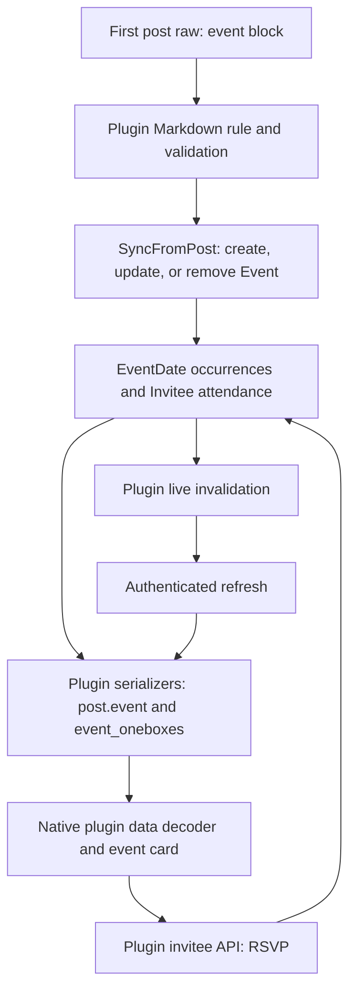

# Post events: investigation and implementation proposal

Investigated on 7 September 2026 against Discourse checkout `2e9dc47bd88`
and native checkout `cf61100e`. The Discourse plugin subtree was clean. This
document records the source findings and proposal that guided the implemented
native module. See [the module README](../lib/src/plugins/discourse_events/README.md)
for its current feature coverage and boundaries.

Implement this as one native `discourse-events` module under
`lib/src/plugins/discourse_events/`. It should own event records, HTTP routes,
RSVP state, cards, authoring, notifications, and event discovery. Core should
continue to expose opaque plugin data and generic rendering, transport,
navigation, and lifecycle facilities. The existing architecture covers most
of the feature. A shared timezone port and a small addition to composer target
information would make the remaining integration respect the current
boundaries without exceptions.

The screenshot represents a private recurring post event. Its essential native
behavior includes the date tile, name and creator, correctly zoned time range,
recurrence, meeting link, permitted attendee information, three configurable
RSVP choices, and the distinction between attending once and attending this
and following occurrences. A private event is an attendance policy; the topic
containing it can itself be public or private.

The source entry points are [the server plugin registration](/Users/joffreyjaffeux/Code/pr-discourse/plugins/discourse-events/plugin.rb:19),
[the native plugin architecture](/Users/joffreyjaffeux/.codex/worktrees/e1f7/discourse-native/docs/plugin-architecture.md:107),
and [the existing post rendering contracts](/Users/joffreyjaffeux/.codex/worktrees/e1f7/discourse-native/lib/src/plugin_api/site_plugin_api.dart:91).

The plugin has been renamed to `discourse-events`. Its public endpoints and
message-bus channel retain the `discourse-post-event` spelling. Some stored
names and calendar subscription scopes also retain `discourse-calendar`.
Keep these names at the plugin's wire boundary; use `discourse-events` as the
native module owner. The server has both `discourse_events_enabled` and
`discourse_post_event_enabled` settings. Current source is the verified
baseline; support for older serializers should be established with fixtures,
including any legacy setting aliases, rather than inferred from version names.

The complete server data flow is:

An event's primary key is its owning **post ID**, not its topic ID. There is
one event per post, and normal authoring validates that it appears in the first
post and that the post contains only one event. The cooked
`div.discourse-post-event` contains author-supplied `data-*` attributes and the
description. It does not contain the complete interactive card. The web
decorator renders that card using the personalized `post.event` serializer.
Therefore native rendering needs both a recognized cooked element and the
matching plugin record. Parsing the HTML alone cannot establish attendance,
capacity, permissions, or the current recurrence.

Creation, editing, closing, reopening, and removing the block use the ordinary
post creation/edit workflow. `Event::SyncFromPost` parses the raw post and
creates, updates, or destroys the event. Recurrence dates, invitations, topic
custom fields, chat membership, reminders, webhooks, and workflow triggers
remain server responsibilities. Native must not reproduce these side effects.
See [the Markdown rule](/Users/joffreyjaffeux/Code/pr-discourse/plugins/discourse-events/assets/javascripts/discourse/lib/discourse-markdown/discourse-post-event-block.js:1),
[the validator](/Users/joffreyjaffeux/Code/pr-discourse/plugins/discourse-events/lib/discourse_events/events/validator.rb:22),
[post synchronization](/Users/joffreyjaffeux/Code/pr-discourse/plugins/discourse-events/app/services/discourse_events/events/event/sync_from_post.rb:5),
and [the web decorator](/Users/joffreyjaffeux/Code/pr-discourse/plugins/discourse-events/assets/javascripts/discourse/initializers/discourse-post-event-decorator.gjs:102).

The relevant HTTP contract is below. `E` means the event/owning-post ID and `I`
means a persisted invitee ID. JSON suffixes are supported by the request specs.

| Operation | Endpoint | Request / response |
| --- | --- | --- |
| Read one event | `GET /discourse-post-event/events/E.json` | `{event: ...}` with the current viewer's permissions and attendance |
| List events / resolve a topic | `GET /discourse-post-event/events.json` | `{events: [...]}`; `topic_id`, `post_id`, date, category, tags, search, attendance, status, and format filters |
| Request full list records | Same list endpoint | `include_details=true`; otherwise basic records, or card records with `include_card=true` |
| Join / first RSVP | `POST /discourse-post-event/events/E/invitees.json` | `{invitee: {status: "going", recurring: false}}` → `{invitee: ...}` |
| Change RSVP | `PUT /discourse-post-event/events/E/invitees/I.json` | Same nested payload; always send the intended `recurring` value |
| Withdraw RSVP | `DELETE /discourse-post-event/events/E/invitees/I.json` | Success acknowledgement; refresh the event afterwards |
| Read participants | `GET /discourse-post-event/events/E/invitees.json` | `filter` and `type`; `{invitees: [...], meta?: {suggested_users: [...]}}` |
| Invite others | `POST /discourse-post-event/events/E/invite` | Separate organizer action; bulk and CSV variants also exist |
| Export calendar | `GET /discourse-post-event/events.ics` | Filterable authenticated calendar feed |
| Delete event record | `DELETE /discourse-post-event/events/E.json` | Exists, but the normal editor removes the raw block through post editing |

The JSON index does not supply a default `after` bound to Finder. Its fallback
to `Time.current` only controls recurring occurrence expansion; non-recurring
occurrences retain their original dates. Upcoming / My Events must request
an ISO timestamp for the current time with `include_ongoing=true` so completed
non-recurring events cannot fill the ascending query's first 200 rows. Finder
retains events whose end is at or after that bound. Although `2e9dc47bd88`
accepts `after=now`, its parent controller calls `String#to_datetime` when
expanding each event and fails on that value for nonempty lists. The web
calendar and list use explicit ISO timestamps, which native follows for
compatibility. Explicit historical API ranges and the ICS snapshot's server
defaults remain separate.
See [the index](/Users/joffreyjaffeux/Code/pr-discourse/plugins/discourse-events/app/controllers/discourse_events/events_controller.rb:9),
[date filtering](/Users/joffreyjaffeux/Code/pr-discourse/plugins/discourse-events/lib/discourse_events/events/finder.rb:139),
and [occurrence expansion](/Users/joffreyjaffeux/Code/pr-discourse/plugins/discourse-events/app/services/discourse_events/events/action/expand_occurrences.rb:24).

There is **no registered event-create or event-update JSON endpoint** in this
checkout. The JS API service still contains an `updateEvent` helper that issues
a PUT to an unregistered route. Implement against routes, controllers, and
request specs, rather than copying every service method. Editing only the event
record would also leave the raw block capable of recreating it.
See [routes](/Users/joffreyjaffeux/Code/pr-discourse/plugins/discourse-events/config/routes.rb:5),
[event reads and list serialization](/Users/joffreyjaffeux/Code/pr-discourse/plugins/discourse-events/app/controllers/discourse_events/events_controller.rb:7),
[invitee requests](/Users/joffreyjaffeux/Code/pr-discourse/plugins/discourse-events/app/controllers/discourse_events/invitees_controller.rb:30),
and [post-based editor actions](/Users/joffreyjaffeux/Code/pr-discourse/plugins/discourse-events/assets/javascripts/discourse/components/discourse-post-event/more-menu.gjs:175).

The existing native user API key requests `read,write,session_info,notifications`.
The server's ordinary read/write scopes cover these HTTP methods, so the card
and RSVP flow should use the existing account and transport facilities. No
event-specific authentication flow is indicated by this source. Calendar feed
subscription keys are a separate server feature, not a prerequisite for RSVP.
See [native scopes](/Users/joffreyjaffeux/.codex/worktrees/e1f7/discourse-native/lib/src/data/user_api_key.dart:96)
and [server scope matchers](/Users/joffreyjaffeux/Code/pr-discourse/app/models/user_api_key_scope.rb:3).

Permissions must remain presence-sensitive. A valid `event` object establishes
that this post has event data; site settings govern presentation and authoring
options. `can_update_attendance == true` authorizes displaying active RSVP
controls for a connected account. `can_act_on_discourse_post_event == true`
governs organizer actions, and `can_create_discourse_post_event` on the fresh
current-user response governs creation. Organizer permission does not imply
permission to RSVP to a private event. The server checks membership, topic
visibility, closed/expired state, invitee ownership, and capacity on writes.

| State | Native behavior |
| --- | --- |
| `public` | Eligible viewers can RSVP; the web UI permits withdrawal |
| `private` | Attendance is restricted to invited groups; a visible topic alone is insufficient |
| `standalone` | Information card without RSVP |
| Closed or expired | Show the event's state; disable attendance mutations |
| Full | Disable a new Going choice, while allowing an existing Going attendee to change their response; Interested can still be allowed |
| `minimal` | The web card suppresses attendee presentation and Going / Not Going controls; Interested remains configurable |
| Missing `stats`, `sample_invitees`, or `raw_invitees` | Preserve absence; do not manufacture a zero count or reveal a participant list |

`watching_invitee` is the current account's persisted attendance record. Sample
participants can contain synthetic invitations with **no invitee ID and a null
status**. Never choose a write target from an avatar sample. `stats.invited` is
a total that includes answered and unanswered invitations, rather than just the
number still awaiting a response. The participant endpoint is capped at 200;
it does not expose offset/cursor pagination. `event_participation_buttons`
contains `not going` with a space; the write status is `not_going`.

The private-event web UI tries to clear a selected response with `status: null`,
but `UpdateInvitee`'s current service contract accepts only Going, Interested,
and Not Going. This is a source-level inconsistency, confirmed by the contract
spec's accepted values. Do not promise that private-response clearing works;
use the three supported transitions initially and resolve that server contract
before reproducing the toggle-to-clear behavior. Deletion also has different
UI semantics from retaining an unanswered private invitation.
See [permission checks](/Users/joffreyjaffeux/Code/pr-discourse/plugins/discourse-events/lib/discourse_events/events/guardian_extensions.rb:5),
[attendance eligibility](/Users/joffreyjaffeux/Code/pr-discourse/plugins/discourse-events/app/models/discourse_events/events/event.rb:447),
[privacy-sensitive serialization](/Users/joffreyjaffeux/Code/pr-discourse/plugins/discourse-events/app/serializers/discourse_events/events/event_serializer.rb:167),
[participant listing](/Users/joffreyjaffeux/Code/pr-discourse/plugins/discourse-events/app/services/discourse_events/events/list_invitees.rb:7),
and [the update contract](/Users/joffreyjaffeux/Code/pr-discourse/plugins/discourse-events/app/services/discourse_events/events/update_invitee.rb:8).

Date handling needs its own plugin model and formatter. The server sends three
different shapes:

| Wire shape | Meaning and display |
| --- | --- |
| `all_day: true`, date strings such as `2026-09-08` | Calendar dates; retain the date components without converting through the device timezone. The displayed end date is inclusive. |
| Timed event, `show_local_time: false`, offset-bearing timestamp | An instant; display in the account timezone, falling back to the device timezone and then UTC. |
| Timed event, `show_local_time: true`, offset-free timestamp | Wall time in the event's `timezone`; resolve that named zone explicitly and display the event timezone. |

The date tile and time range must use the same policy. Never pass offset-free
event timestamps through a generic date parser that silently chooses the
device timezone. Invalid or unknown zones need an explicit degraded display,
without claiming a converted instant. Crossing midnight, daylight-saving
changes, device timezone changes, and account timezone changes all matter.
The server can synthesize a displayed one-hour end for a timed event without
an explicit end; this is not sufficient evidence for computing `is_expired`
locally. Preserve the server flags and refresh when time-sensitive data becomes
stale.

Recurrence is owned by `EventDate` and the server scheduler. A Going RSVP with
`recurring: true` carries forward; the server resets other attendance when
advancing the occurrence. Recurrences include daily, weekdays, weekly, two
weeks, four weeks, and monthly. Monthly means the ordinal weekday, with the
fifth occurrence represented as the last weekday of that month. It is not a
fixed day-of-month interval. Use the returned occurrence dates and `rrule`;
do not calculate a parallel recurrence schedule for the topic card.

The list API can expand one event into several `occurrences`. Future calendar
items therefore need identity `(eventId, occurrenceStart)`, while RSVP writes
still address the series' current event ID. Only recurring Going attendance
applies to future occurrences. The web card filters its sample, Going count,
current-user response, and capacity when hydrating a later occurrence. Future
calendar cards should initially link to the event for RSVP unless that behavior
is deliberately reproduced. Closed/expired series can have null current dates.
See [date serialization](/Users/joffreyjaffeux/Code/pr-discourse/plugins/discourse-events/app/serializers/discourse_events/events/basic_event_serializer.rb:68),
[recurrence rules](/Users/joffreyjaffeux/Code/pr-discourse/plugins/discourse-events/lib/discourse_events/events/rrule_configurator.rb:6),
[attendance reset](/Users/joffreyjaffeux/Code/pr-discourse/plugins/discourse-events/app/models/discourse_events/events/event.rb:652),
and [future-occurrence card hydration](/Users/joffreyjaffeux/Code/pr-discourse/plugins/discourse-events/assets/javascripts/discourse/components/discourse-post-event/index.gjs:245).

These are the proposed native ownership boundaries:

| Responsibility | Owner and existing extension |
| --- | --- |
| Module installation | `DiscourseEventsModule`, added to both bundled manifests |
| Post event plus linked event records | `PostEventsPlugin implements PostRecordPlugin<PostEventsData>`; immutable value in `PluginData` |
| Topic/list date metadata | Separate `EventTopicPlugin implements TopicRecordPlugin<EventTopicData>`, with the same module owner |
| Settings and current-user creation permission | Plugin-owned `SiteSettingsPlugin` / `CurrentUserPlugin` readers and persistence codecs |
| Inline card placement | `PostBodyPlugin` at the matching event element, before core onebox/quote handling |
| Cooked-only fallback | `CookedElementPlugin` with a descriptive, noninteractive fallback |
| HTTP requests | `EventsApi` / `EventsApiClient` over `PluginApiTransport` |
| Hydration, RSVP, pending/error state | A session-owned `PostEventsController` with an internal event repository |
| Services for widgets | An events-owned service key resolved through `PluginUiScope` |
| Topic/list date badges | `TopicListMetadataPlugin` and `TopicPropertiesPlugin` |
| Event invitations/reminders | `NotificationTypePlugin`, with event-owned wording and icons |
| Creation/edit UI | `ComposerSyntaxPlugin`, `ComposerToolbarPlugin`, and verified `ComposerEditorHost` changes |
| Upcoming / My Events | Later plugin-owned routes, sidebar contribution, content widgets, and route handler |

Post and topic readers should be separate capability objects because their
interfaces both expose `record`; using different record types in a single
implementation would conflict. Multiple capabilities under one module owner
are already supported, as demonstrated by Discourse AI. There is no reason to
add `Post.event`, event fields on `Topic`, typed event methods on `DiscourseApi`,
or event branches to `CookedHtml` or `ShellController`.

Suggested files are `discourse_events_module.dart`, `post_events_plugin.dart`,
`event_topic_plugin.dart`, `post_event.dart`, `post_events_data.dart`,
`events_api.dart`, `events_api_client.dart`, `post_events_controller.dart`,
`event_repository.dart`, `post_event_card.dart`, `event_date_formatter.dart`,
`event_invitees_sheet.dart`, `event_notifications.dart`, and
`discourse_events_services.dart`. Add authoring files when implementing that
stage. Keep event-specific assets, strings, markup fixtures, and tests with
this owner. Helpers should follow actual responsibilities rather than turn
each operation into another architectural layer.

For post data, use a wrapper with an optional owning event and a map of
`event_oneboxes` keyed by linked topic ID. Decode the parts independently, so
one malformed linked event does not discard a valid owning event. If neither
part exists, return null. For the verified edit serializer, take the incoming
value, including null when an event/block is removed. Do not preserve an old
event by copying the Reactions edit merge policy. Changes from older supported
servers require explicit fixtures and reconciliation rules.

An internal topic onebox is an
`aside.quote[data-topic][data-post='1']:not([data-username])`. The serializer
preloads the authorized event in `event_oneboxes`; ordinary manual quotes must
remain quotes. The event's `post.id` and `post.topic.id` govern actions, links,
and subscriptions. The containing post is only where the card is displayed.
Read the supplied payload first to avoid a request for each link. Cooked-only
Chat, quote, revision, or preview fragments lack an authoritative post record:
show a static fallback or explicitly hydrate through the plugin's own API.
Never attach the containing post's event to an arbitrary nested event marker.
See [onebox preload and access checks](/Users/joffreyjaffeux/Code/pr-discourse/plugins/discourse-events/lib/discourse_events/events/onebox_data.rb:40)
and [native replacement ordering](/Users/joffreyjaffeux/.codex/worktrees/e1f7/discourse-native/lib/src/shell/cooked_html.dart:58).

The repository should be scoped to a site/account session, with entries keyed
by event ID and view handles released when cards unmount. Initial authenticated
post data can seed an entry without another request. Thereafter one controller
owns accepted refreshes and mutation results across the original card, linked
cards, and a participant sheet. Use request generations and account leases;
do not compare fetch completion times as though they were server revisions.
The event serializer has no general revision token. Rebuilds must not reseed an
entry with stale embedded data. New source snapshots can invalidate an already
hydrated entry; the repository then fetches an authoritative event response.
This also avoids maintaining independent mutable copies in each card.

For RSVP, the controller should:

1. Validate the current event identity, signed-in session, serialized permission,
   desired status, recurrence choice, and capacity state.
2. Acquire the shared `PluginPostHost` write lane using the **event's post ID**,
   then capture a `PluginRequestHost` lease and obtain write credentials.
3. Show a pending choice and disable duplicate submissions. Keep aggregate
   counts based on server responses; do not predict private invitation totals.
4. POST if the current account has no persisted `watching_invitee`; PUT using
   its ID otherwise. Handle withdrawal separately with DELETE.
5. Accept the returned invitee and its `meta.event_stats` /
   `meta.event_should_display_invitees`, then revalidate the complete event for
   capacity, samples, and permissions. Where the owning post is loaded, update
   only the events-owned `PluginData` key through `PluginPostHost`.
6. Reconcile topic state through `PluginTopicRefreshHost`: Going sets topic
   Watching, Interested sets Tracking, and Not Going / withdrawal affect the
   notification level too. Native should read these server side effects.
7. On a 403, capacity rejection, stale invitee, or ambiguous network result,
   restore/reconcile from the server. A timed-out POST may already have created
   attendance: fetch before deciding whether another write is necessary.
8. Commit only while the account lease and operation generation are current,
   release the write lane, and settle any invalidation received during the write.

The server publishes `/discourse-post-event/{topicId}` with `{id: eventId}`.
This is an invalidation hint, not personalized event data. For an owning-topic
only implementation, `TopicLivePlugin` already maps it to a post refresh. Full
linked-card support should instead give the repository scoped channel handles
via `corePluginTrackerPort` / `PluginTrackerAttachment`, declare
`PluginLiveChannelScope.prefix('/discourse-post-event')` in both descriptor and
registration, and retain one subscription per visible event topic. Validate
the channel and ID against known entries. Use one refresh owner per entry,
rather than duplicate host and repository subscriptions.

Coalesce bursts, invalidate reads that began before a mutation, and refresh
active handles after reconnect/foreground. Release subscriptions and personal
data on account invalidation, site removal, and session close. No background
retention is needed for a card. Server notifications already deliver reminders.
The server scheduler also publishes core topic reloads when occurrences finish;
normal host topic refresh and plugin snapshot invalidation must cooperate.
See [live publication](/Users/joffreyjaffeux/Code/pr-discourse/plugins/discourse-events/app/models/discourse_events/events/event.rb:387),
[topic tracking effects](/Users/joffreyjaffeux/Code/pr-discourse/plugins/discourse-events/app/models/discourse_events/events/invitee.rb:115),
[native host ports](/Users/joffreyjaffeux/.codex/worktrees/e1f7/discourse-native/lib/src/plugin_api/core_plugin_host.dart:71),
and [current live post reconciliation](/Users/joffreyjaffeux/.codex/worktrees/e1f7/discourse-native/lib/src/shell/shell_controller.dart:2950).

There is a concurrency boundary to test explicitly: the shared post write lane
protects live post refreshes, while a full topic response enters through
`_absorb`, which currently writes the payload's posts directly. Do not assume
that lane protects every possible snapshot. Keep the plugin's pending overlay
and authoritative repository refresh ordering independent of stale seeds, and
test a slow pre-RSVP topic request completing after the write. If core post
state requires stronger ordering, extend generic request/write generation
handling for all plugins; an events-specific exception would violate the
boundary. [Current topic absorption](/Users/joffreyjaffeux/.codex/worktrees/e1f7/discourse-native/lib/src/shell/shell_controller.dart:5268).

The card should use shared theme, avatar/image, link, and cooked-content
primitives. Render `description_html` and `location_html` as nested content
without post authority. Honor `url_restates_location` to avoid showing the same
meeting link twice, and fall back to plain text when older servers omit cooked
fields. Render event names with topic-title fallback, capacity, closed/expired
state, organizer identity, and optional image. On narrow layouts the RSVP
controls should wrap or stack and the recurring Going menu should remain easy
to reach. Selected states need semantic labels, keyboard focus, and a visual
indicator independent of color. Authentication and failure states should be
visible at the card, with a link to the event when an operation is unavailable.

Two small generic native additions are justified by the source:

| Need | Proposed core change | Event-specific responsibility |
| --- | --- | --- |
| Use the app's timezone database/device-zone updates without ambient singleton access | A read-only timezone host port around existing `TimezoneEnvironment`, injectable in tests; expose lookup, reader-zone resolution, and change observation | Event time parsing, date-only representation, display policy, recurrence labels |
| Determine whether authoring targets the opening post | Add neutral `editingPostNumber` information and a topic-creation fact that includes PM creation to the composer plugin snapshot/host | Enforce one event, first-post eligibility, and event creation/edit permission |

`TimezoneEnvironment` is already initialized by app bootstrap, so no dependency
on Local Dates is needed. The existing boundary test specifically rejects
`TimezoneEnvironment.instance` in other plugin files. Add the generic port
instead of extending that exception. Its facade should not grant plugins
device-zone mutation or environment disposal. `ComposerEditorHost` currently
has `isNewTopic` / `isEdit` / `isReply`, but no edited-post number; the plugin
cannot distinguish adding an event to a first post from adding one to a reply.
See [timezone support](/Users/joffreyjaffeux/.codex/worktrees/e1f7/discourse-native/lib/src/foundation/timezone_environment.dart:6),
[the enforced singleton boundary](/Users/joffreyjaffeux/.codex/worktrees/e1f7/discourse-native/test/plugin_dependency_boundary_test.dart:414),
[composer contracts](/Users/joffreyjaffeux/.codex/worktrees/e1f7/discourse-native/lib/src/plugin_api/composer_syntax.dart:22),
and [host state assembly](/Users/joffreyjaffeux/.codex/worktrees/e1f7/discourse-native/lib/src/shell/shell_controller.dart:6216).

Authoring should use namespaced syntax such as `discourse-events/event`, with
a plugin-owned parser, draft, editor, and lossless replacement. Preserve
unrecognized attributes, quoting, custom fields, image references, and text
outside the event block. The published event serializer exposes the current
occurrence, not all original authoring values: initialize editing from the raw
block so a recurring event's original start is not silently moved forward.
Verify document identity before applying a sheet result and preserve source
for unknown or malformed syntax. Avoid importing Poll's parser or Local Dates'
formatter implementation. Any reusable lexical utility should be genuinely
generic, with the event grammar remaining in the events plugin. Saving should
continue through core's existing post/draft/upload workflows. Organizer menu
actions can open the normal post editor initially; a direct event-editor launch
would need a narrow generic edit-composer entry point rather than access to the
concrete shell. The current composer host's specialized `buildComposer` is
scoped to plugin-owned targets, and its existing shared launch is for new topics.

The remaining feature surfaces can stay in the same module:

- Decode `event_starts_at`, `event_ends_at`, `event_all_day`, and the optional
  topic timezone/display-policy fields into `EventTopicData`. Topic-list rows
  contain less information than a topic detail; missing metadata must remain
  unknown rather than be interpreted as a complete event.
- Register reminder type **27 / `event_reminder`** and invitation type
  **28 / `event_invitation`** in the plugin. Own their payload parsing, known
  message variants, wording, actor policy, and calendar icon. Core already has
  a safe unknown-notification fallback and ordinary topic navigation. No new
  notification enum members or special counter are necessary.
- Upcoming / My Events can use the existing content and route seams. Respect
  basic versus detailed list responses, server filtering/privacy, occurrence
  expansion, and the event query limit (default and maximum 200). Occurrence
  expansion defaults to 50 per event and is capped at 200. A calendar page is
  additional product work beyond the post card.
- For calendar export, prefer the server ICS representation when implementing
  authenticated feeds. `PluginApiTransport` currently returns JSON only: add a
  bounded generic text/byte download capability if needed, with plugin-owned
  endpoint selection and core-owned authentication. Use ordinary native file
  sharing; do not place the account API key in an externally opened URL. A
  plugin-owned local ICS export is another option, but must preserve all-day
  exclusive DTEND and the server recurrence semantics.
- Optional event Chat navigation can use a normal URL handled by Chat's route
  integration. Embedded Chat would require a declared dependency and an
  owner-provided contract. Event rendering and RSVP must work with Chat absent.
  The two event chat paths (`channel` and livestream topic-chat association)
  are distinct. In this checkout `livestream_chat_channel_id` is serialized
  from the association row's `id`, while topic-view `chat_channel_id` is the
  actual chat channel ID: do not interchange them.
- Livestream/Zoom presentation can initially use the event's authorized links.
  Embedded video and Zoom joining are separate integrations, with server-issued
  access and provider-specific behavior. No event code should import the
  lazy-video plugin's implementation or reimplement Chat membership changes.
- Category calendars, `[calendar]` blocks, holidays, and group timezones are
  other features in the server plugin. They do not need to be implemented to
  support post events. If category-specific event metadata is later needed,
  native `TopicCategory` currently lacks a plugin-data codec seam; add a generic
  category-record extension instead of event fields in the core model.

Useful sources for these surfaces are [server notification IDs](/Users/joffreyjaffeux/Code/pr-discourse/app/models/notification.rb:155),
[event notification presentation](/Users/joffreyjaffeux/Code/pr-discourse/plugins/discourse-events/assets/javascripts/discourse/initializers/discourse-calendar.gjs:80),
[event finder](/Users/joffreyjaffeux/Code/pr-discourse/plugins/discourse-events/lib/discourse_events/events/finder.rb:6),
[ICS output](/Users/joffreyjaffeux/Code/pr-discourse/plugins/discourse-events/app/views/discourse_events/events/index.ics.erb:1),
[transport contract](/Users/joffreyjaffeux/.codex/worktrees/e1f7/discourse-native/packages/discourse_plugin_api/lib/src/plugin_transport.dart:1),
and [livestream association](/Users/joffreyjaffeux/Code/pr-discourse/plugins/discourse-events/app/models/discourse_events/livestream/topic_chat_channel.rb:5).

Implement in coherent stages:

1. **Read and participate:** module, codecs, timezone port, card, cooked fallback,
   participant sheet, recurring RSVP choices, lifecycle-safe writes, live
   refresh, linked event cards, and invitation/reminder presentation. Include
   the screenshot's private recurring case and the privacy/state variants above.
2. **Author and manage:** generic composer target facts, lossless event syntax,
   event builder, first-post validation, edit/remove/close/reopen through post
   editing, and topic/list date presentation. Add organizer invitations once
   their UI and API error cases are covered.
3. **Discover and integrate:** Upcoming / My Events, calendar export, organizer
   bulk/report tools, and optional media/chat integration. Preserve explicit
   web entry points for functionality awaiting a native implementation.

Verification should cover behavior and boundaries, not just widget snapshots:

| Area | Required cases |
| --- | --- |
| Decoder | Absent/null event; malformed independent onebox; partial list record; null expired dates; synthetic invitee without ID; absent private stats; future optional fields |
| Identity | Event ID differs from topic ID; linked card differs from containing post; identical numeric IDs on two sites |
| Permissions | Public/private/standalone; hidden group membership; organizer who cannot RSVP; closed/expired/full; account permission changes |
| Writes | Exact nested POST/PUT payloads; recurring true/false; withdrawal; duplicate taps; stale invitee; 403/404/422; timeout after successful server commit |
| Time | Offset-bearing and offset-free dates; all-day across zones; midnight; DST; device/account zone changes; ordinal monthly recurrence; exhausted series |
| Concurrency | Live echo during RSVP; older GET completing last; pre-write topic response; post edit during hydration; two cards for one event; disconnect/account switch during a read or write |
| Lifecycle | Reference-counted subscriptions; background/foreground refresh; tracker replacement; unmount, site forget, and session close |
| Authoring | Exactly one first-post event; new PM versus reply; unknown attributes; original recurrence anchor; descriptions/quotes; unchanged surrounding text; stale sheet result |
| Presentation | Screenshot case at desktop and narrow widths; participant omission; minimal/configured buttons; plain-text fallback; nested/quoted content; account connection; readable errors |
| Separation | Core-only decoding/rendering; events without Poll, Local Dates, or Chat; no events-owned wire fields in core; foreign service/data access rejected |

Use `RecordingPluginTransport` for endpoint contracts and `PluginHostHarness`
for lifecycle, ownership, and navigation. Existing Poll write/live tests are
useful behavioral references, with event-specific expectations for privacy,
capacity, recurrence, and topic tracking. Update the bundled module registries
and boundary-test directory mapping; extend schema-leak assertions to cover
events. Add an owner-local markup contract catalog for the Markdown rule and
decorator, plus fixtures covering serializers, raw attributes, RSVP responses,
and channel payloads. The generic drift runner already discovers plugin-owned
catalogs.

Source inspection included server models, parsers, synchronization services,
controllers/routes, serializers, guardian checks, scheduler, frontend card and
editor behavior, oneboxes, request/service/serializer specs, and native plugin
contracts, composition, rendering, persistence, timezone, composer, and live
reconciliation. The complete native suite passes 5,967 tests in both normal
and randomized order (seed `2111232603`). It covers event contracts, privacy,
authoring, presentation, lifecycle, and dependency boundaries.
Static analysis reports no issues for the root app,
Voice package, or full compatibility profile, and the formatting gate passes.
Native tests use recorded server-shaped payloads and controlled transports;
they do not establish
live-server or device-platform verification. The server inconsistencies called
out above remain explicit constraints of the native implementation.
